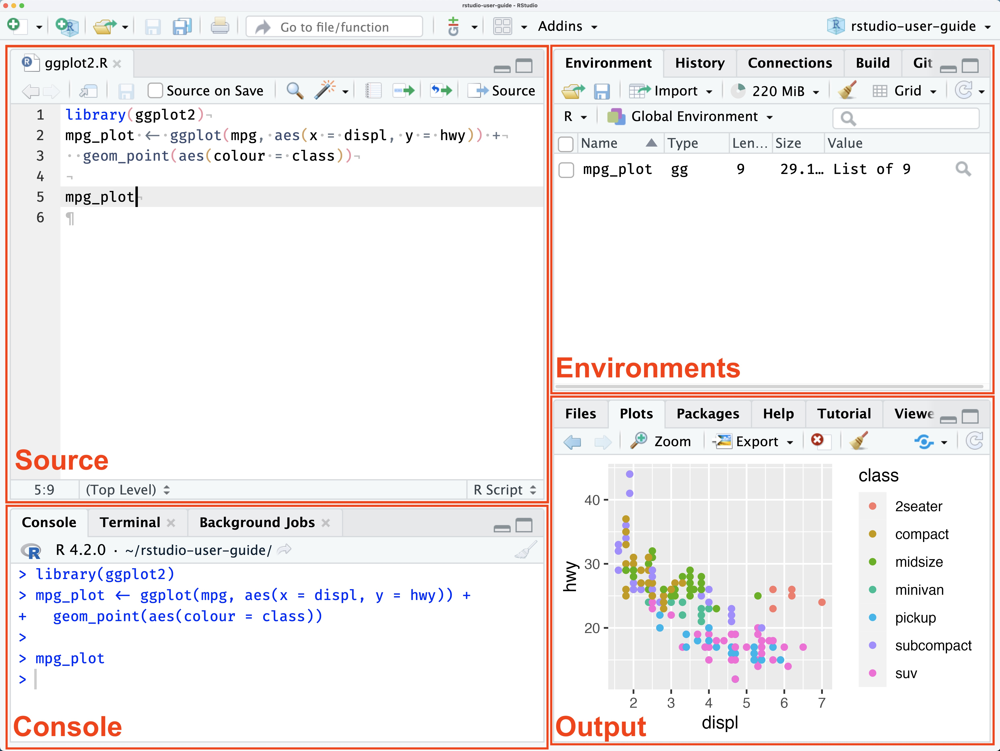
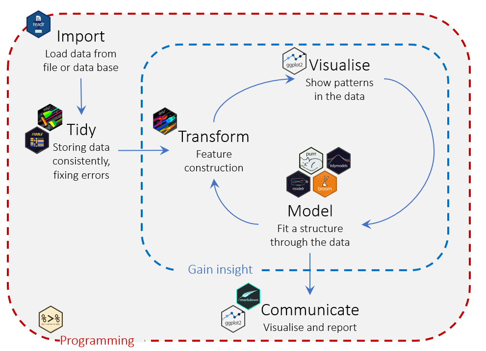

## How to use R?

There are several options:

-   install R on your computer

-   use R+RStudio via [Posit Cloud](https://posit.cloud/plans)

-   use R+RStudio via [Binder](https://mybinder.org/)

         
[](https://mybinder.org/v2/gh/xcit-courses/R-intro-labs/HEAD?urlpath=rstudio)


# Installing R

## Install R

Visit <https://cloud.r-project.org/>

You can find instructions to install R on your specific OS online.

[Here](https://www.geeksforgeeks.org/r-language/how-to-install-r-studio-on-windows-and-linux/) for example.


# Install R now!


## The R console

``` {.default code-line-numbers="false"}
R version 4.6.1 (2026-06-24) -- "Happy Hop"
Copyright (C) 2026 The R Foundation for Statistical Computing
Platform: x86_64-pc-linux-gnu

R is free software and comes with ABSOLUTELY NO WARRANTY.
You are welcome to redistribute it under certain conditions.
Type 'license()' or 'licence()' for distribution details.

R is a collaborative project with many contributors.
Type 'contributors()' for more information and
'citation()' on how to cite R or R packages in publications.

Type 'demo()' for some demos, 'help()' for on-line help, or
'help.start()' for an HTML browser interface to help.
Type 'q()' to quit R.

>
```


## Using R like a calculator

::::: columns
::: {.column width="50%"}
``` {.default code-line-numbers="false"}
R version 4.6.1 (2026-06-24) -- "Happy Hop"
...
Type 'q()' to quit R.

> 2 + 3
[1] 5
> 10 / 4
[1] 2.5
> sqrt(16)
[1] 4
>
```
:::

::: {.column width="50%"}
### Example

``` r        
>        # How can I help?
> 1 + 2  # Press Enter: I want to know the answer
         # Please evaluate this expression
[1] 3    # Here's the result
>        # Anything else?
```
:::
:::::

## Try it out!

-   12 / 5.5
-   2 \> 1
-   (5-2) \<= (8 %% 3)
-   2\^5
-   sqrt(9)
-   log2(32)

## Key concepts

Example 1:

``` r        
log2(32)
```

Example 2:

``` r        
1 + 2
```

What are these symbols? Are there different kinds of things?

## Code is text


``` r
age <- c(18, 23, 43)
mean_age <- mean(age)
print(paste0("The mean age is ", round(mean_age, 1), " years."))
```


# What is RStudio?

## Install RStudio!

Download the free **RStudio Desktop** for your operating system (Windows, macOS or Linux):

<https://posit.co/download/rstudio-desktop/>

-   Install R first, then RStudio
-   The current version is RStudio 2026.09


## IDE: Integrated development environments

The R GUI is bare bones.

Programmers use IDEs to work effectively.

IDEs provide tons of features that make programming easier and more fun.


## RStudio

{fig-align="center"}


## Some key benefits of RStudio

- see and work on more files at the same time
- see the current state of your environment
- inspect data
- code completion, syntax highlighting
- help
- package management
- data import wizzard
- ...and much more.


# Packages


## Install packages

Packages offer you additional functionality (functions, code, data not included in base R).

You will almost always use additional packages, but depending on your specific needs you might use different ones. 


## To use a package involves two simple steps:

### Step 1: download the package

This is done only once (but you may need to redownload if there is a newer version of package). 

To download a package, you need to "install" the package (e.g., using `install.packages("package_name")`)


### Step 2: load the package
A package is not automatically available; you need to activate it before you can use it. 

To activate a package, first you must have installed it. Second you need to call `library("package_name")`. 


<br>
Beginners often mix this up this two steps. 

You can do those steps either using code (e.g., typed in the console) or by using RStudio package panel.


## Example: installing the "swirl" package (using code)

### Step 1:
In the console type

``` r
install.packages("swirl")
```

"swirl" is the name of the package we want to download on our computer.

This command will download the code from that package from CRAN and put in on your computer.


## Example: installing the "swirl" package (using code)

### Step 2:


Each time you want to use that package, you need to load it into R.

In the console, type:

``` r
library("swirl")
```

Now the code from the swirl package is aviable for use. 


# Exercise: Install the `ggplot2` package


# Exercise: Install the `tidyverse` package


## Tidyvserse

Tidyverse is a set of well-designed packaged that work very well together to effectively accomplish 90% of the data science tasks.

{fig-align="center"}


## Conclusion

We've installed R and RStudio and we've seen how to install packages.

We are now ready to start programming. 
